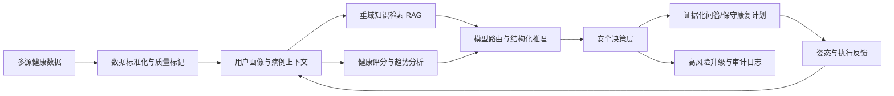

# 康复智伴竞赛技术方案与技术栈

## 1. 项目定位

本项目面向中国研究生人工智能创新大赛“开放赛题——垂直领域学科/专业/场景大模型”，项目名称建议统一为：

> **康复智伴：面向多病共存老年人的居家康复安全决策大模型**

系统不是将通用问答模型简单嵌入健康 App，而是围绕“多病共存、长期用药、居家康复、数据不完整”这一具体场景，构建从数据采集到安全行动建议的垂直智能系统。系统的主要任务是健康管理、风险提示和康复辅助，不进行疾病诊断，不替代医生作出医疗决定。

竞赛中应突出以下核心问题：

1. 老年人的健康数据来自设备、手工记录、药品图片、健康报告和动作执行等异构来源，格式和可信度不同。
2. 单条健康指标没有完整意义，模型必须结合用户画像、用药、近期趋势、既往报告和康复目标理解病例上下文。
3. 健康建议必须受到风险、证据和资料完整性的约束；在证据不足时，系统宁可降低建议强度、要求补充资料或升级人工咨询，也不能生成看似确定的个性化医嘱。
4. 系统输出不仅是文字，还包括证据、风险等级、行动标签、升级路径和康复计划，能够进入后续执行与反馈闭环。

## 2. 总体技术架构

系统分为六个逻辑层：

| 层次 | 主要技术 | 竞赛价值 |
|---|---|---|
| 交互层 | Vue 3、TypeScript、Vite、Pinia、Vuetify、ECharts | 将复杂健康信息转换为适合老年人和照护者使用的界面 |
| 服务编排层 | Spring Boot 3.5、Java 17+、REST API、模型路由、Prompt 模板 | 将问答、康复、评分、设备和饮食能力组合成可审计流程 |
| 垂域智能层 | DashScope 对话/视觉模型、Embedding、RAG、结构化 JSON 输出、LLM 缓存 | 让通用基座模型受垂域知识、病例上下文和输出契约约束 |
| 数据与知识层 | MySQL、Flyway、Redis/Redis Stack、向量检索、BM25、重排序、MMR | 将领域知识和用户历史转化为可检索、可追溯的数据资产 |
| 安全决策层 | 急症规则、风险合并、证据检查、不确定性、升级标签、病例约束 | 防止模型在高风险和资料不足时过度承诺 |
| 评测与工程层 | data card、按病例族切分、baseline/RAG/RAG+safety 三臂对照、自动化测试 | 支持可复现的竞赛验收，而不是只展示一次演示 |

## 3. 前端技术栈

### 3.1 应用框架与工程化

- **Vue 3 + Composition API**：按业务模块组织首页、监测、问答、用药、饮食、设备、康复和知识库页面。
- **TypeScript**：为问答响应、证据、安全元数据、病例结构、评分结果和设备数据建立类型约束，降低前后端字段漂移风险。
- **Vite**：提供开发服务器、API 代理和生产构建。
- **Pinia**：管理认证状态、健康数据、设备同步状态、用户画像和页面级共享状态。
- **Vue Router**：按登录、健康管理、康复计划、设备接入和资料上传进行路由隔离。
- **Vuetify、Tailwind CSS、ECharts、Lucide/MDI 图标**：实现可读性优先的中文健康管理界面、趋势图和风险卡片。

### 3.2 面向竞赛演示的交互设计

前端不只展示“AI 回答”，而是将一次决策拆成：

1. 用户问题或健康数据输入；
2. 当前病例摘要；
3. 检索到的知识与用户数据证据；
4. 风险等级、不确定性和安全提示；
5. 建议动作、禁止动作和升级路径；
6. 康复计划以及后续执行反馈。

问答页和康复页应把 `evidence`、`safety`、`action_tags`、`escalation` 等字段直接可视化。这样评委能看到系统如何作出决定，而不是只能看到一段无法解释的自然语言。

### 3.3 多模态前端入口

- 药品图片上传：进入 OCR/药品识别链路，并保留人工核对入口。
- 食物图片上传：进入视觉识别、营养目录匹配和分量估计链路。
- 健康报告上传：进入结构化信息抽取和病例证据保存链路。
- 姿态或动作数据：进入姿态推理服务，输出动作执行反馈。
- 设备数据同步：展示 Apple Health、BLE、OAuth 厂商设备和手动输入的来源与最近同步时间。

## 4. 后端技术栈

### 4.1 服务框架

- **Spring Boot 3.5 + Java 17+**：承载认证、用户画像、监测、用药、饮食、问答、RAG、康复、设备和评分 API。
- **Spring Web/Validation/Security**：提供 REST 接口、请求校验、无状态 Token 认证和权限控制。
- **Spring JDBC**：对用户级健康数据和审计数据采用显式 SQL 查询，确保 `user_id` 隔离条件清晰可审计。
- **Spring Data Redis**：支持 RAG 文档/向量、LLM 缓存、OAuth replay registry 等共享状态。
- **Springdoc OpenAPI**：生成接口说明，便于答辩展示系统边界和联调方式。
- **JUnit 5、MockMvc、Testcontainers**：验证控制器、服务、数据库迁移、权限和安全契约。

### 4.2 服务模块

| 模块 | 技术职责 | 竞赛叙事 |
|---|---|---|
| `consult` | 健康问答、证据映射、历史审计、安全合并 | 面向病例上下文的垂域问答 |
| `ai` | 模型客户端、模型路由、Prompt 模板、缓存、答案模板 | 让基座模型适配不同健康子场景 |
| `context` | 用户画像、健康基线、用药、行为和交互记忆 | 形成持续更新的个人病例上下文 |
| `rag`/`knowledge` | 文档摄入、分块、嵌入、检索、重排和知识服务 | 将领域知识转成可追溯证据 |
| `rehab` | `RehabCase`、安全约束、计划生成、周计划 | 把问答转化为保守、可执行的康复动作 |
| `scoring` | 多指标评分、个人基线、趋势、数据质量 | 将原始指标变成可解释状态而非单一分数 |
| `diet` | 食物识别、营养目录匹配、饮食日志、审计 | 处理视觉识别不确定性和营养数据溯源 |
| `device` | HealthKit、BLE、OAuth 厂商和手动数据聚合 | 统一多设备健康数据来源 |
| `security` | 管理端白名单、OAuth state、隐私与访问边界 | 降低健康数据和外部回调风险 |

## 5. 垂域大模型与模型路由

### 5.1 基座模型接入

当前系统通过统一的 `DashScopeService` 接入对话和视觉模型，模型名通过环境变量配置，默认配置包括对话模型 `kimi-k2.5` 和向量模型 `text-embedding-v3`。API Key 只从服务端环境变量读取，不写入代码、文档或知识库。

系统还保留 OpenMed 等专业模型服务的可选接入点，用于药品、医学实体或专业识别场景；在服务不可用时按照显式降级策略回退，不能把外部服务调用失败伪装成模型成功。

### 5.2 模型路由

`ModelRouterService` 根据问题意图和场景选择 Prompt 模板，例如：

- 用药问题：药品说明、依从性和相互作用相关约束；
- 血压问题：趋势、测量条件和风险升级约束；
- 睡眠问题：恢复情况、行为建议和资料缺失约束；
- 运动/康复问题：动作强度、禁忌、姿态反馈和安全边界；
- 一般健康问题：通用健康管理回答模板。

模型路由的价值不在于增加模型数量，而在于让同一个基座模型在不同垂域任务中使用不同的输入结构、证据范围和输出字段。

### 5.3 Prompt 与结构化输出

- Prompt 模板由服务端管理并可版本化，避免把关键规则散落在前端。
- 模型输出要求包含摘要、建议、证据、风险、安全提示和下一步行动等字段。
- 服务端对模型 JSON 做解析、字段归一化和默认值补全。
- 模型输出只能补充安全元数据，不能降低确定性规则已经判定的风险等级。
- 高频、稳定问题可经过答案模板直接响应，减少无必要的模型调用。

### 5.4 缓存与可复现性

LLM 缓存按场景、Prompt 内容和用户上下文哈希区分，支持精确缓存和语义缓存。用户上下文哈希用于防止“相同问题、不同用户”错误复用结果。竞赛演示时应固定模型、Prompt 版本、温度、知识库版本和案例版本。

> 当前核心实现是“基座模型 + 垂域知识 + 病例上下文 + 安全决策层”，不是已经完成大规模预训练或医学 LoRA 训练的独立基础模型。若后续补充 LoRA/SFT，应同时提交训练集版本、参数、训练日志、模型卡和盲测结果，不能只在申报书中宣称完成微调。

## 6. RAG 垂域知识库

### 6.1 知识资产

知识库按应用任务组织，而不是堆积网页文本。建议至少维护以下知识类型：

- 药品说明、服药注意事项和相互作用规则；
- 慢病健康管理与指标解释；
- 老年人居家康复动作、禁忌和动作分级；
- 睡眠、压力、活动和恢复建议；
- 食物营养目录、分量和营养素字段；
- 高风险症状的升级与就医提示。

每份知识文档都应保存来源、版本、采集时间、适用范围、清洗规则、文档类型和可信度。真实医疗资料在授权、脱敏和专业复核后才能进入正式数据集。

### 6.2 摄入与检索流程

1. 文档解析与规范化；
2. 按标题、段落、规则边界进行分块；
3. 生成向量并保存元数据；
4. 查询扩展，将用户口语映射到垂域术语；
5. 向量检索与 BM25 关键词检索混合召回；
6. 使用重排序模型调整候选顺序；
7. 使用 MMR 去除重复证据，保留多样性；
8. 将最终证据映射为回答中的 `ConsultEvidence`，展示标题、来源、文档类型和相关片段。

当前 `RagSearchService` 的设计为向量权重 0.7、BM25 权重 0.3，先取较大的候选集，再重排和 MMR 选出最终 Top-K。Redis/Redis Stack 用于生产向量存储；当向量服务不可用时，系统安全降级为空检索结果或内置知识服务，不阻塞安全判断。

### 6.3 RAG 的垂域价值

RAG 不是“给模型外挂搜索框”，而是将回答限制在可审核的领域证据内，并把“回答为什么这样说”转成可展示、可记录的证据链。竞赛材料应展示同一病例在 baseline、RAG、RAG+safety 三种条件下的差异。

## 7. 用户画像、病例上下文与记忆

`ContextService` 将当前用户的资料聚合为上下文快照，包含：

- 身份和基本体征：年龄、性别、身高、体重等；
- 健康基线：静息心率、睡眠、压力、VO2、步数等；
- 当前用药：药品、剂量、时间和依从性摘要；
- 行为上下文：活动、睡眠、饮食和康复执行情况；
- 已保存报告：风险标签和报告证据；
- 交互记忆：用户已经提出的问题和已确认事项；
- 照护上下文：需要通知的照护者或升级路径。

上下文在服务端按当前用户隔离，构造稳定摘要后才注入 Prompt。RAG 知识库不直接摄入用户私有问诊历史和康复动作，以避免跨用户泄露。问答、计划和饮食修改保留审计记录，便于追踪系统输入、输出和后续修正。

## 8. 安全决策层

这是项目区别于普通健康 App 的关键技术层。系统采用“确定性规则优先、模型结果只能补充”的保守合并策略。

### 8.1 问答安全

- `ConsultSafetyService` 对大出血、严重胸痛、呼吸困难等急症关键词进行确定性识别。
- 命中急症规则时直接进入紧急升级分支，不等待模型自由发挥。
- 没有检索证据时强制加入 `uncertain` 标记，并要求补充资料或寻求专业咨询。
- 模型返回的风险等级只能提高细节，不能覆盖规则已经判定的高风险等级。
- 输出包含风险等级、标记、行动标签、升级路径、免责声明和证据列表。

### 8.2 康复安全

`RehabCaseService` 将监测基线、用药、保存报告、病例证据、计划约束和安全边界合并为统一的 `RehabCase`：

- 缺少年龄、身高或体重时，不计算个性化热量和强度基线；
- 高风险病例仅允许低强度、受监督的动作，并提示线下专业复核；
- 睡眠不足、压力升高或静息心率偏高时，降低训练量并优先恢复；
- 没有可用证据时，输出资料收集和人工确认动作，不生成虚假的个性化处方；
- 计划通过 `action_tags`、时间范围、姿态约束和不可用状态明确表达边界。

### 8.3 生产降级原则

开发环境可以通过显式开关使用 mock fixture；生产环境不得在真实请求失败时静默返回随机健康数据。外部设备、视觉模型、向量服务或大模型不可用时，系统应返回可识别的服务状态和安全降级结果。

## 9. 健康评分与数据质量

`HealthScoringService` 对心率、睡眠、压力、VO2、运动、HRV、步数、站立、活动能量、血压和用药依从性等指标进行分项计算，并同时输出：

- 当前值、个人基线、近期趋势和偏移量；
- 分项分数、权重、风险说明和关注类型；
- 可执行动作建议；
- `dataQuality` 和 `dataWarnings`；
- 没有数据、数据稀疏和指标不足时的显式状态。

评分的竞赛表达应是“可解释的健康状态表征和决策输入”，而不是“医学诊断分数”。系统不会把缺失值当作正常值，也不会用演示数据冒充真实设备测量。

## 10. 多模态与专业子链路

### 10.1 药品识别

药品图片经过 OCR/视觉识别后，与药品目录和药品知识服务匹配；识别置信度不足时要求人工核对。专用药品识别服务不可用时，系统可回退到垂域视觉链路，但必须显式标记识别来源和不确定性。

### 10.2 食物识别与营养估计

食物图片先由视觉模型提取食物名称、关键词、分量和置信度，再与营养目录匹配。只有命中目录才计算营养值；未命中时返回零营养值并要求人工复核，避免把模型猜测当成营养事实。饮食日志按用户隔离，支持新增、修改、删除和 `diet_log_audits` 前后快照审计。

### 10.3 姿态与动作反馈

姿态推理服务使用 MediaPipe 等视觉姿态组件，将关键点或动作阶段转换为康复动作的执行反馈。姿态结果作为病例或计划反馈输入，而不是单独生成医疗诊断。答辩时应演示“计划动作—姿态执行—安全提示—下一次计划调整”的闭环。

### 10.4 健康报告与骨龄等扩展能力

报告结构化抽取、骨龄或其他专用视觉能力属于可插拔扩展模块。它们可以证明系统的多模态扩展能力，但不应喧宾夺主；主线仍然是多病共存老年人的居家康复安全决策。

## 11. 设备与数据接入

设备聚合层统一处理：

- Apple HealthKit 原生桥接；
- BLE 健康设备；
- Garmin、Oura、Fitbit、Withings、Polar、Whoop、Dexcom、Strava、小米和 Zepp 等 OAuth/厂商接口；
- Rook 或 SDK 推送；
- 手动输入和导入文件。

所有来源转换为统一的指标、时间戳、设备来源、同步状态和数据质量字段。OAuth state 使用服务端 HMAC、provider/user 绑定、过期时间、单次消费和 Redis 共享 replay registry，避免回调参数被篡改或重复使用。真实设备凭据和生产授权仍需在最终部署环境中补齐，不能用测试凭据宣称已完成真实设备验证。

## 12. 数据库、缓存与持久化

- **MySQL**：用户、画像、监测、用药、咨询历史、康复计划、饮食日志、审计记录和设备连接信息。
- **Flyway**：以版本化 SQL 管理表结构和数据契约，当前迁移覆盖安全证据、饮食偏好、饮食日志和审计等能力。
- **Redis/Redis Stack**：向量文档、检索索引、LLM 缓存、OAuth replay registry 和多实例共享状态。
- **Caffeine**：本地热点缓存，适合答案模板和低风险重复查询。
- **无状态 Token**：请求通过认证上下文解析用户，服务层对每一次查询、写入和删除执行用户隔离。

## 13. 隐私、安全与合规边界

1. API Key、数据库密码、JWT Secret、设备 token 和 OAuth secret 只通过环境变量或受控配置注入。
2. 健康数据按用户隔离，RAG 知识库不混入用户私有历史。
3. 上传文件、报告、饮食修改和问答结果保留必要的审计线索，支持删除和导出边界说明。
4. 高风险问答、证据不足和计划资料缺失必须可解释地升级或拒答。
5. 项目定位为健康管理和康复辅助，不宣称诊断、处方或临床准确率。

## 14. 评测与证据体系

### 14.1 当前可复现证据

- 后端测试：91 项通过；
- 前端测试：15 个测试文件、42 项通过；
- 前端 TypeScript 类型检查和生产构建通过；
- 垂域评测工具：9 项 Python 测试通过；
- 6 个 synthetic cases 通过 data-card 校验；
- `git diff --check` 通过。

这些结果证明工程契约、边界条件和评测工具可以运行，不等于临床准确率、真实用户效果或专家认可。

### 14.2 三臂对照

评测工具保留三种独立实验臂：

1. **Baseline**：基座模型直接回答；
2. **RAG**：加入领域知识检索和证据；
3. **RAG+safety**：在 RAG 之上加入确定性安全决策层。

建议报告以下指标：

- 证据覆盖率和来源正确率；
- 高风险建议拦截率；
- 升级路径一致性；
- 行动标签完整率；
- 病例字段和约束满足率；
- 平均检索耗时、模型耗时和端到端延迟；
- 不同数据完整度下的降级行为。

数据集必须按 `source_case_family` 分组切分，防止同一病例模板泄露到训练和测试两侧。真实盲测集、授权记录和康复/药学专家复核仍属于下一阶段工作。

## 15. 与普通健康 App 的区别

| 普通健康 App | 康复智伴垂域系统 |
|---|---|
| 展示指标和静态建议 | 将指标、用药、报告、行为和目标组合成病例上下文 |
| 调用通用聊天接口 | 模型路由、Prompt 版本、垂域 RAG 和结构化输出 |
| 只返回自然语言 | 返回证据、风险、不确定性、行动标签和升级路径 |
| 缺数据时照样给建议 | 识别数据不足，降低强度、补充资料或拒绝个性化 |
| 单次问答结束 | 计划执行、姿态反馈、监测更新和下一次计划形成闭环 |
| 无法解释分数来源 | 提供个人基线、趋势、可用指标和数据质量说明 |
| 演示数据可静默替代真实数据 | 生产关闭随机 mock，服务失败显式暴露并安全降级 |

## 16. 竞赛创新点的建议表述

### 创新点一：病例中心的垂域上下文建模

将多病共存老年人的监测、用药、报告、饮食、睡眠、动作和历史交互统一为 `RehabCase`，使模型处理的是一个动态病例，而不是孤立的一问一答。

### 创新点二：证据约束与安全决策协同

将 RAG 证据、确定性风险规则和模型输出合并为可审计决策。模型可以生成解释，但不能越过急症规则、资料完整性和康复强度约束。

### 创新点三：多模态数据到行动计划的闭环

把设备时序数据、图片识别、健康报告和姿态反馈转换为结构化健康状态，再生成保守的康复动作和下一步行动。

### 创新点四：数据质量感知的个性化

系统把“没有数据”“数据稀疏”“模型低置信度”和“证据冲突”作为决策输入，避免因为缺失值而产生虚假精确的评分或计划。

### 创新点五：面向竞赛复现的评测工程

通过 data card、病例族切分、三臂对照、证据覆盖、风险拦截和延迟拆分，展示系统改进来自哪一个模块，而不是只展示一条成功案例。

## 17. 申报书和答辩中的准确措辞

建议使用：

- “面向居家康复安全决策的垂直场景大模型系统”；
- “基座模型经过领域知识增强、病例上下文注入和安全决策约束”；
- “输出可追溯证据、风险等级、不确定性和行动建议”；
- “在健康管理和康复辅助范围内提供决策支持”。

不建议在当前证据不足时使用：

- “实现临床诊断”；
- “替代医生”；
- “达到某种临床准确率”；
- “已经完成真实患者验证”；
- “已经完成大规模医学模型训练”。

## 18. 下一阶段技术计划

1. 固化一条黄金病例：多病共存、长期用药、睡眠下降、血压趋势异常和康复动作执行反馈。
2. 建立脱敏、授权、版本化的专家案例集和知识数据卡，完成训练/验证/盲测边界。
3. 完成 baseline/RAG/RAG+safety 三臂盲测，并分别统计安全、证据、完整性和延迟指标。
4. 邀请康复、药学或全科背景人员复核高风险病例，形成评分表和修订记录。
5. 在资源允许时对高频任务补充 LoRA/SFT 或偏好优化，并与不微调的 RAG+safety 版本做成对比较。
6. 完成真实设备授权、Redis 多实例部署、隐私说明和演示环境冻结。
7. 形成“数据卡 + 模型卡 + 系统架构图 + 评测报告 + 三分钟演示 + 风险声明”的完整竞赛材料包。

## 19. 当前限制

当前仓库已经具备较完整的工程闭环和安全契约，但真实盲测集、专家独立评分、真实设备生产凭据和临床验证尚未完成。后续材料应把这些内容列为验证计划或限制，不应把合成病例和自动化测试包装为临床结论。
