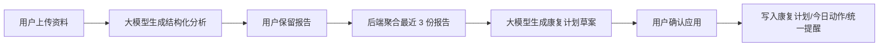
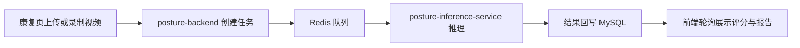

# 康复智伴开发文档

## 1. 项目概述

康复智伴是一个面向居家康复和健康管理场景的多端协同应用。当前版本以 Web 前端为主入口，后端采用 Java 主业务后端 + 姿态识别微服务链 + 本地药品识别副链的组合架构。

当前主链功能如下：

1. 用户登录后进入总览页。
2. 用户上传化验单、影像资料、文字报告或症状描述。
3. 系统调用大模型生成结构化分析报告。
4. 用户保存报告，并基于最近 3 份已保存报告生成康复计划草案。
5. 用户确认后将草案应用到当前康复计划。
6. 用户配置用药提醒、康复提醒、设备入口，并通过 AI 助手进行健康问答。

当前并行副链如下：

- 动作拍摄纠错副链：用于康复页中的动作录制、视频上传、姿态分析与评分。
- 本地药品识别副链：供 `/api/medications/recognize/custom-model` 预留接入，不替换正式大模型药品识别主链。

## 2. 应用结构

### 2.1 仓库结构

```text
E:\VScodeProject\health-app
  backend-java/                     Java 主业务后端
  posture-backend/                  姿态识别任务后端
  posture-inference-service/        姿态识别推理服务
  local_medication_api/             本地药品识别副链
  start-local-stack.ps1             一键启动脚本
  健康监测与分析平台/
    docs/                           交付文档
    public/                         静态资源
    src/
      api/                          前端 API 模块
      composables/                  全局通知与调度逻辑
      layouts/                      页面布局
      modules/
        assistant/                  AI 助手
        auth/                       登录注册
        home/                       总览首页
        medication/                 用药提醒
        profile/                    个人中心
        rehab/                      康复计划与姿态识别入口
        upload/                     上传分析
      router/                       路由
      shared/                       通用组件与工具
```

### 2.2 前端结构

- 路由层：负责页面切换、登录保护和布局挂载。
- 页面层：负责交互与流程控制。
- API 模块层：负责请求封装和前端数据归一化。
- 组合式逻辑层：负责提醒调度、全局状态、滚动控制等可复用逻辑。
- 通用组件层：负责按钮、卡片、下拉框、弹窗、导航、通知等复用组件。

### 2.3 后端结构

#### Java 主业务后端 `backend-java`

职责：

- 认证、总览、监测、设备、个人设置
- 上传分析、报告保存、报告列表与详情
- 康复计划草案生成、应用康复计划、统一康复提醒
- 用药闹钟、多药品提醒
- 正式大模型药品识别 `/api/medications/recognize`
- AI 助手普通问答与流式问答

技术：

- Spring Boot
- MySQL
- HikariCP

#### 姿态识别微服务链

- `posture-backend`：负责任务创建、排队、状态查询、结果落库
- `posture-inference-service`：负责视频姿态推理

并发策略：

- 主 Java 后端不引入 Redis
- 姿态识别链使用 Redis 做任务排队和削峰

#### 本地药品识别副链 `local_medication_api`

职责：

- DINO-SO-YOLO 检测
- RapidOCR 文本提取
- 本地规则字段组装

边界：

- 正式主链 `/api/medications/recognize` 继续走大模型
- 副链只服务 `/api/medications/recognize/custom-model`
- 副链默认不替换主链

## 3. 开发环境设计

### 3.1 软件环境

| 项目 | 说明 |
| --- | --- |
| 操作系统 | Windows 10 / 11 |
| Node.js | 20.x |
| npm | 11.x |
| 前端 | Vue 3 + TypeScript + Vite |
| 测试 | Vitest + Vue Test Utils + Testing Library |
| Java | JDK 21（主业务后端） |
| Java | JDK 8（姿态识别旧后端兼容） |
| Python | 3.10+ |
| 数据库 | MySQL 8.x |
| 队列 | Redis（仅姿态识别链使用） |
| 模型网关 | 百炼 / Kimi |
| 本地 OCR | rapidocr_onnxruntime |

### 3.2 运行端口

| 服务 | 地址 |
| --- | --- |
| 前端 | `http://127.0.0.1:4173` |
| Java 主后端 | `http://127.0.0.1:3302` |
| 姿态识别后端 | `http://127.0.0.1:8080` |
| 姿态推理服务 | `http://127.0.0.1:8000` |
| 本地药品识别副链 | `http://127.0.0.1:8011` |

### 3.3 环境变量

前端：

- `VITE_API_BASE_URL`
- `VITE_POSTURE_API_BASE_URL`
- `VITE_DEV_PROXY_TARGET`
- `VITE_DEV_POSTURE_PROXY_TARGET`

主业务后端：

- `DB_URL`
- `DB_USERNAME`
- `DB_PASSWORD`
- `DASHSCOPE_API_KEY`
- `DASHSCOPE_BASE_URL`
- `DASHSCOPE_CHAT_MODEL`
- `DASHSCOPE_VISION_MODEL`
- `CUSTOM_MEDICATION_RECOGNIZE_URL`

姿态识别链：

- `POSTURE_REDIS_URL`
- `POSTURE_INFERENCE_BASE_URL`

本地药品副链：

- `LOCAL_MEDICATION_WEIGHTS`
- `LOCAL_MEDICATION_DEVICE`
- `LOCAL_MEDICATION_CONFIDENCE`
- `LOCAL_MEDICATION_IOU`
- `LOCAL_MEDICATION_OCR_ENABLED`

## 4. 主要功能与界面说明

### 4.1 登录 / 注册

- 电脑端与手机端分别适配
- 简洁认证卡片布局
- 登录后默认进入总览页

### 4.2 总览页

整合原“总览”和“监测”：

- 健康摘要
- 监测趋势
- 已保存报告折叠区
- 报告全览弹窗
- 设备入口
- 康复计划摘要
- 今日活动清单

### 4.3 上传分析

支持：

- 影像资料
- 化验报告
- 文字报告
- 症状描述

流程：

1. 选择资料类型。
2. 上传文件或输入文本。
3. 调用大模型生成结构化分析结果。
4. 点击“保留并生成康复计划”。
5. 后端保存当前报告并生成康复计划草案。
6. 用户点击“应用到康复计划”后正式覆盖当前计划。

### 4.4 用药提醒

当前使用“一组闹钟包含多种药品”的结构：

- 闹钟创建、修改、删除
- 一次识别后自动回填药品字段
- 多图上传与拍照采集
- 正式主链大模型识别
- 副链本地药品识别预留
- 系统通知、站内浮层、震动提醒

### 4.5 康复计划

康复计划包含三部分：

- 计划摘要
- 今日动作清单
- 统一提醒

并在康复页内新增动作拍摄纠错专区：

- 深蹲
- 俯卧撑
- 平板支撑
- 弓步蹲

### 4.6 AI 助手

- 右下角悬浮入口
- 全屏对话页
- 预设问题
- 流式输出
- 本地历史记录

### 4.7 设备管理

已提供：

- 设备列表与入口
- Web 蓝牙方向预留
- Android Health Connect 桥接预留

预留数据类型：

- 心率
- 静息心率
- HRV
- 睡眠
- 体温
- 血氧
- 血压
- 步数

## 5. 高层设计

### 5.1 主业务数据流



### 5.2 姿态识别数据流



### 5.3 药品识别边界

- 主链：`/api/medications/recognize`，使用大模型
- 副链：`/api/medications/recognize/custom-model`，使用本地副链
- 二者并行但默认断开

## 6. 共享数据样例

### 6.1 用户与报告

- 演示用户：`liming@example.com`
- 已保存报告：包含摘要、关注点、建议、康复重点、风险标签

### 6.2 康复动作

- 鸟狗式
- 死虫式
- 髂腰肌拉伸
- 弹力带划船

### 6.3 设备数据

- 心率
- 睡眠评分
- 压力值
- 周趋势 / 月趋势 / 六个月趋势

## 7. 数据流转与展示方式

### 7.1 上传分析结果

- 后端保存结构化报告 JSON
- 总览页折叠展示简要信息
- 点击“全览”弹出完整报告详情

### 7.2 康复计划

- 上传分析不直接改计划
- 只有用户在上传页确认“应用到康复计划”后才覆盖现有计划

### 7.3 提醒系统

- 用药提醒和康复提醒都走全局调度
- 当前 Web 方案依赖页面运行中的轮询、系统通知和站内浮层

## 8. UI 原型与截图

截图统一放在：

- `docs/assets/screenshots/`

重点截图包括：

- 登录页
- 总览页
- 上传分析页
- 用药提醒页
- 康复页
- AI 助手页

## 9. 软硬件说明

### 软件

- Windows 11
- Edge / Chromium
- MySQL 8
- Redis
- Java 21 / Java 8
- Python 3.10+

### 硬件

- 普通开发笔记本即可运行前端、主后端和本地副链
- 若需要姿态识别稳定推理，建议具备可用 CPU 多核或基础 GPU 环境

## 10. 当前边界

- 正式大模型链路仍受外部网关时延影响
- Web 提醒不是原生后台闹钟
- Health Connect 仍需原生桥接
- 本地药品副链已可运行，但默认不替换正式入口\n
## 9. iOS 改造与健康评分

### 9.1 Apple Health 接入

已将 Android HealthConnect 桥接替换为 Apple Health 数据层：

- **数据层**: src/modules/home/services/appleHealthBridge.ts
  - 支持原生 window.AppleHealthBridge 接口（WKWebView / JSCore）
  - 未接入原生壳时回退到本地模拟数据
  - 参考: [HKObjectType](https://developer.apple.com/documentation/healthkit/hkobjecttype)

- **数据模型**: AppleHealthSnapshot
  - 心率（平均/最小/最大）
  - 静息心率、HRV
  - 血压（收缩压/舒张压）
  - 血氧饱和度
  - 睡眠阶段（core/deep/rem）
  - 步数、体温、呼吸率

### 9.2 健康评分算法

评分引擎: src/modules/home/services/healthInsightService.ts

**权重分配**:
| 维度 | 权重 | 说明 |
|------|------|------|
| 睡眠质量 | 30% | 直接映射 0-100 |
| 压力负荷 | 25% | 越低越好，带高负荷惩罚 |
| 静息心率 | 20% | 55-75 bpm 理想带 |
| 血压状态 | 15% | 收缩压/舒张压综合评估 |
| 活动量 | 10% | 目标 8000 步梯度 |

**风险判定**:
- 综合分 >= 82: 低风险（总体稳定）
- 综合分 62-81: 中风险（需关注）
- 综合分 < 62: 高风险

**AI 建议**: 基于最弱维度自动生成咨询问题，接入 AI 助手获取个性化建议。

### 9.3 设备模块 UI 重构

设备面板: src/modules/home/components/HomeDevicePanel.vue

**设计变更**:
- 去除 Android / HealthConnect 文案
- 使用 lucide-vue-next 图标（Bluetooth, Watch, Heart, RefreshCw, Trash2）
- 双通道入口: 蓝牙配对 + 健康数据同步
- 设备列表改为紧凑卡片布局
- 操作按钮改为图标按钮

### 9.4 提醒层

提醒架构保持不变（轮询 + Notification API），数据来源已切换到 Apple Health。

**后续接入原生壳时**:
- 替换 
ew Notification() 为 UNUserNotificationCenter
- 替换 
avigator.vibrate() 为 UIImpactFeedbackGenerator
- 通过 window.webkit.messageHandlers 与原生通信
